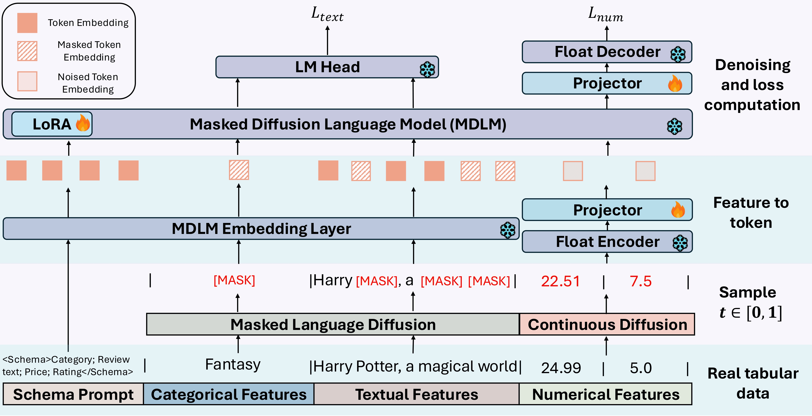

# TabDLM: Free-Form Tabular Data Generation via Joint Numerical–Language Diffusion
<div align="center">
      
### [[Paper](https://arxiv.org/pdf/2602.22586)]

_**[Donghong Cai](https://ilikevegetable.github.io/), [Jiarui Feng](https://jiaruifeng.github.io/), [Yanbo Wang](https://yanxwb.github.io/), [Da Zheng](https://zheng-da.github.io/), [Yixin Chen](https://www.cse.wustl.edu/~yixin.chen/), [Muhan Zhang](https://muhanzhang.github.io/)**_

Washington University in St. Louis, Peking University, Ant Group

</div>

Official implementation of **TabDLM**, a framework for synthetic tabular data generation that couples a diffusion language model with continuous numerical diffusion. TabDLM learns joint denoising over numerical, categorical, and free-form text features, and supports standard tabular as well as tabular-with-text generation.



---

## Installation

**Requirements:** Python 3.10, a CUDA-capable GPU (recommended ≥ 40 GB; reduce batch size if needed).

```bash
git clone https://github.com/ilikevegetable/TabDLM.git
cd TabDLM
```

Create a conda environment and install dependencies:

```bash
conda create -n tabdlm python=3.10 -y
conda activate tabdlm

# Install PyTorch for your CUDA build first (see https://pytorch.org)
pip install torch torchvision --index-url https://download.pytorch.org/whl/cu124

pip install -r requirements.txt
```

---

## Data

Prepared splits are already included under `data/tabular/<dataset_name>/` (`train.csv`, `valid.csv`, `test.csv`, `info.json`, `*.jsonl`). **You do not need to rerun data preparation** for the benchmark datasets in this repo.

Ground-truth tables for evaluation live under `data/synthetic/<dataset_name>/`. Scripts such as `data/prepare_tabular_data.py` and `data/tabular_wtext_generation_*.py` are kept only for reference or custom datasets.

---

## Quick Start

All commands assume the repository root:

```bash
export PYTHONPATH=.
```

Train and sample (with evaluation) for a dataset using the provided shell scripts:

```bash
bash scripts/run_shoppers.sh
bash scripts/run_biography.sh
bash scripts/run_rel_arxiv.sh
# ... see scripts/run_*.sh
```

Each script runs `python main.py train` then `python main.py sample` with the hyperparameters used in our experiments. Checkpoints and `train_args.json` are written to `ckpt/<dataset_name>/<description>_{best,last}/`. Synthetic CSVs are saved under `result/<dataset_name>/synthetic_result/`.

---

## Project Structure

```
TabDLM/
├── main.py                 # Entry: `train` | `sample`
├── tabdlm/
│   ├── model.py            # TabDLM (dLLM + numerical diffusion)
│   ├── cli/train.py, cli/sample.py
│   ├── diffusion.py, hFloatEmb.py, noise_schedule.py
├── utils/
│   ├── dataset.py, configs.toml, sampling_postprocess.py
├── data/tabular/           # Prepared splits (ready to use)
├── eval/                   # density, C2ST, MLE, match scores
├── scripts/run_*.sh        # End-to-end train + sample per dataset
└── ckpt/, result/          # Created at runtime
```

---

## Citation

If you find TabDLM useful, please cite:

```bibtex
@misc{cai2026tabdlmfreeformtabulardata,
      title={TabDLM: Free-Form Tabular Data Generation via Joint Numerical-Language Diffusion},
      author={Donghong Cai and Jiarui Feng and Yanbo Wang and Da Zheng and Yixin Chen and Muhan Zhang},
      year={2026},
      eprint={2602.22586},
      archivePrefix={arXiv},
      primaryClass={cs.LG},
      url={https://arxiv.org/abs/2602.22586},
}
```

---

## Acknowledgements

Our codebase and experimental pipeline are inspired by and built upon prior open-source efforts. In particular, we would like to thank the authors of [TabDiff](https://github.com/MinkaiXu/TabDiff) for releasing their implementation; their mixed-type diffusion framework and tabular data generation pipeline greatly facilitated our research. We are very grateful for their excellent work.

---

## License

This project is released under the [MIT License](LICENSE).

---

